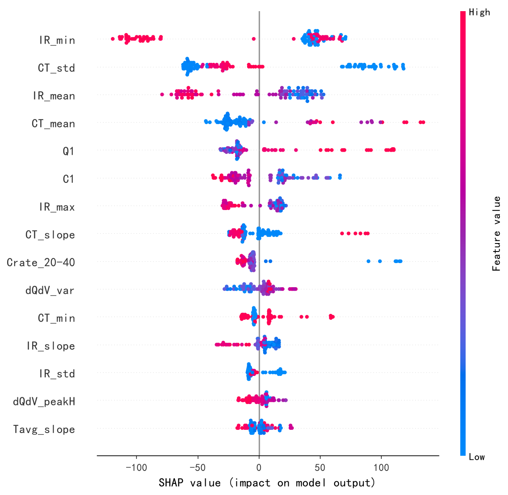
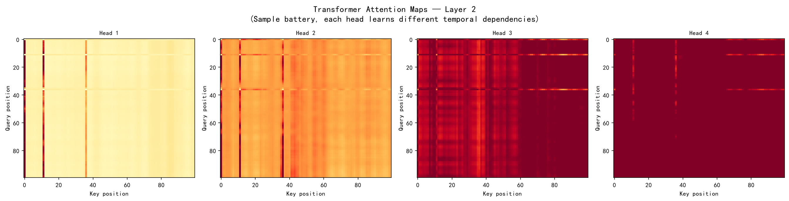

# MIT-Stanford 电池数据集分析报告

> 124 颗 A123 LFP 18650 电池（额定容量 1.1 Ah），68 种快充策略

---

## 1. 数据集概况

| 项目 | 说明 |
|------|------|
| 数据来源 | Severson et al., *Nature Energy*, 2019 |
| 电池型号 | A123 18650 磷酸铁锂 (LFP) |
| 电池数量 | 124 颗 |
| 额定容量 | 1.1 Ah |
| 原始文件 | `MIT-Stanford Battery Dataset_cleaned.mat` (6.85 GB, HDF5 v7.3) |

### 数据结构

```
batch_combined/
  policy_readable[i]  — 充电策略字符串，如 "8C(35%)-3.6C"
  summary[i]/
    QDischarge (1×N)  — 放电容量 (Ah)
    QCharge    (1×N)  — 充电容量 (Ah)
    chargetime (1×N)  — 充电时间 (小时)
    cycle      (1×N)  — 循环编号
    IR         (1×N)  — 内阻 (Ω)
    Tavg,Tmax,Tmin     — 温度 (°C)
  cycles[i]/           — 各循环完整时间序列 (I, V, t, Qd, Qc, T)
```

---

## 2. 数据预处理

### 2.1 循环编号修正

5 颗电池（bat 0–4）因两个实验数据集拼接导致 `cycle` 列编号重复。以 bat 0 为例：

- 原始 cycle 列：`1→662 → 663→1189 → 1→662`（前 662 个循环编号出现了两次）
- 修正后：`1→1851`（按行顺序重新编号）

其余 119 颗电池的 cycle 编号无需修改（已是 1→N）。

### 2.2 SOH 计算

$$\text{SOH}_i(k) = \frac{Q_{\text{discharge},i}(k)}{1.1\text{ Ah}}$$

其中 $Q_{\text{discharge},i}(k)$ 为第 $i$ 颗电池第 $k$ 次循环的放电容量。

### 2.3 快充策略解析

所有电池采用两阶段 CC-CV 协议：

| 阶段 | 说明 |
|------|------|
| 阶段一 | 以 **C1** 倍率恒流充电至 **Q1%** SOC |
| 阶段二 | 以 **C2** 倍率恒流充电至 **80%** SOC |
| 阶段三 | 1C CC-CV 至满容量，截止电流 C/50（所有电池统一） |

参数范围：

| 参数 | 范围 |
|------|------|
| C1 | 1C – 8C |
| Q1 | 2% – 80% |
| C2 | 3C – 6C |

共 68 种不同策略组合。

---

## 3. 统计结果

### 3.1 整体分布

| 指标 | 最小值 | 最大值 | 中位数 | 均值 |
|------|--------|--------|--------|------|
| 循环寿命 (cycles) | 170 | 2236 | 750 | 817.7 |
| 总充电时间 (hours) | 2128.1 | 31438.0 | 8234.7 | 9128.3 |


### 3.2 长寿策略 Top 5

| 排名 | 策略 | C1 | Q1 | C2 | 平均寿命 | 电池数 |
|------|------|----|----|----|----------|--------|
| 1 | `3.6C(80%)-3.6C` | 3.6C | 80% | 3.6C | 2082 | 3 |
| 2 | `4C(80%)-4C` | 4.0C | 80% | 4.0C | 1570 | 2 |
| 3 | `4.8C(80%)-4.8C-newstructure` | 4.8C | 80% | 4.8C | 1548 | 5 |
| 4 | `5C(67%)-4C-newstructure` | 5.0C | 67% | 4.0C | 1115 | 6 |
| 5 | `5.3C(54%)-4C-newstructure` | 5.3C | 54% | 4.0C | 1073 | 8 |

**特征**：Q1 ≥ 54%（前三均为 80%），C1 与 C2 接近，整体倍率适中。

### 3.3 短寿策略 Top 5

| 排名 | 策略 | C1 | Q1 | C2 | 平均寿命 | 电池数 |
|------|------|----|----|----|----------|--------|
| 1 | `5.6C(65%)-3C` | 5.6C | 65% | 3.0C | 452 | 1 |
| 2 | `6C(52%)-3.5C` | 6.0C | 52% | 3.5C | 449 | 1 |
| 3 | `2C(7%)-5.5C` | 2.0C | 7% | 5.5C | 361 | 1 |
| 4 | `1C(4%)-6C` | 1.0C | 4% | 6.0C | 326 | 1 |
| 5 | `2C(10%)-6C` | 2.0C | 10% | 6.0C | 170 | 1 |

**特征**：Q1 极低（4%–10%），C2 高（5.5C–6C），C1 与 C2 差异大。

---

## 4. 长寿与短寿策略差异分析

将上述 Top 5 长寿策略（平均寿命 1073–2082 cycles）与 Top 5 短寿策略（平均寿命 170–452 cycles）进行逐参数对比：

| 参数 | 长寿策略 (Top 5) | 短寿策略 (Top 5) |
|------|------------------|-------------------|
| C1 范围 | 3.6C – 5.3C | 1.0C – 6.0C |
| C1 均值 | ≈ 4.5C | ≈ 3.3C |
| Q1 范围 | 54% – 80% | 4% – 65% |
| Q1 均值 | ≈ 72% | ≈ 28% |
| C2 范围 | 3.6C – 4.8C | 3.0C – 6.0C |
| C2 均值 | ≈ 4.1C | ≈ 4.8C |
| C1–C2 倍率差 | ≈ 0.4C（几乎一致） | ≈ 1.5C–5.0C（剧烈跳变） |

### 4.1 第一阶段充电倍率（C1）

长寿策略的 C1 集中在 3.6C–5.3C 的中间区间，而短寿策略的 C1 分布在两个极端——要么很低（1.0C–2.0C），要么较高（5.6C–6.0C）。**C1 本身并非决定寿命的关键变量**：长寿策略的 C1 均值（4.5C）甚至高于短寿策略的 C1 均值（3.3C）。这说明在低 SOC 区间，适度提高 C1 并不会直接损害寿命；真正的损害来源于 C1 与后续 C2 的搭配方式。

### 4.2 阶段切换 SOC（Q1）——最关键差异

Q1 是长寿与短寿策略之间差异最悬殊的参数：**长寿策略的 Q1 均值 72%，短寿策略的 Q1 均值仅 28%**。

长寿策略在低 SOC 阶段以适中倍率覆盖了绝大部分充电区间（直到 54%–80% SOC 才切换），电池在电极材料锂离子扩散速率较高的低 SOC 区域接受了温和的电流。而短寿策略在极低 SOC（4%–10%）处即切换至高倍率，意味着**电池在 SOC 还未充分建立时就被迫承受大电流冲击**。在这种条件下，石墨负极表面更易发生锂金属沉积（析锂），形成不可逆的活性锂损失和 SEI 膜过度生长，直接导致容量加速衰减。

### 4.3 第二阶段充电倍率（C2）

短寿策略的 C2 均值（4.8C）显著高于长寿策略（4.1C），且最差的三个策略 C2 达到 5.5C–6.0C。在高 SOC 区间（>50%），电极材料的嵌锂动力学已显著受限，此时施加大倍率电流会导致：

- 极化内阻急剧增大，局部电位越过析锂阈值
- 活性物质颗粒因应力不均而产生微裂纹
- 电解液氧化副反应加速

长寿策略的 C2 始终控制在 4.8C 以内，且与 C1 几乎一致（C1–C2 差约 0.4C），避免了倍率切换带来的电流瞬变冲击。

### 4.4 C1–C2 倍率跳变幅度

长寿策略的 C1 与 C2 基本相等（如 `3.6C→3.6C`、`4.8C→4.8C`），意味着充电过程中电流保持平稳。而短寿策略中最极端的 `1C(4%)-6C` 和 `2C(10%)-6C`，在 Q1 处经历了 **5C 级别的倍率跳变**。这种从极低倍率到极高倍率的瞬时切换会在电极/电解液界面产生剧烈的浓度梯度和应力，是诱发析锂和颗粒破裂的典型工况。

### 4.5 充电时间

长寿策略因采用较低的 C2 倍率（3.6C–4.8C）且覆盖较长的 SOC 区间，单次充电时间相对较长；但由于循环寿命远超短寿策略（1073–2082 vs 170–452 cycles），**总充电时间（即电池全生命周期可使用的累计充电时长）也远高于短寿策略**。短寿策略虽然在单次充电上更快，但以牺牲循环寿命为代价换取的速度优势，在总能量吞吐量上得不偿失。

---

## 5. Spearman 秩相关分析

使用 Spearman 秩相关系数量化充电策略参数与循环寿命之间的单调关系。Spearman 不假设线性关系，ρ ∈ [−1, +1]，p < 0.05 判定为显著。

### 6.1 单一参数 vs 循环寿命

| 参数 | Spearman ρ | p-value | 显著性 | 解读 |
|------|-----------|---------|--------|------|
| C1 (第一步倍率) | +0.106 | 0.241 | 不显著 | C1 本身与寿命无显著单调关系 |
| Q1 (切换SOC%) | **+0.317** | 3.3×10⁻⁴ | (显著) | Q1 越高，寿命越长（中等正相关） |
| C2 (第二步倍率) | **−0.284** | 1.4×10⁻³ | (显著) | C2 越高，寿命越短（弱负相关） |

**解读**：

- **Q1 是最强的单一预测变量**（|ρ| = 0.317）。更高的 Q1 意味着电池在低 SOC 区间停留更长时间后才切换至第二步——此时负极锂离子扩散快，能安全承受更大电流；而过早切换（低 Q1）则使电池在 SOC 尚未充分建立时即承受高倍率冲击。
- **C2 的影响次之**（|ρ| = 0.284），且方向为负：高 SOC 区间的高倍率充电加速老化。
- **C1 不显著**（p = 0.24）。在低 SOC 区间适度提高 C1 并不会系统性缩短寿命——损害来源于 C1 与 C2 的搭配方式，而非 C1 本身。

### 6.2 不同 SOC 区间的高倍率充电影响 (Q4)

将 SOC 0–100% 划分为 5 个区间，对每个电池推导其在各区间的等效 C-rate 暴露量，分别与循环寿命做 Spearman 相关：

| SOC 区间 | Spearman ρ | p-value | 显著性 |
|----------|-----------|---------|--------|
| 0–20% | +0.064 | 0.479 | 不显著 |
| 20–40% | −0.163 | 0.071 | 不显著 (边际) |
| **40–60%** | **−0.330** | 1.8×10⁻⁴ | (显著) |
| **60–80%** | **−0.340** | 1.1×10⁻⁴ | (显著) |
| 80–100% | N/A | N/A | 常数 (所有电池均为 1C CC-CV) |


**核心发现**：

1. **损害梯度随 SOC 单调递增**：低 SOC 区间（0–20%）的 C-rate 与寿命无显著相关（ρ ≈ 0），随着 SOC 升高，负相关性逐步增强，在 60–80% 达到最强（ρ = −0.34(显著)）。

2. **SOC 40–80% 是"危险区间"**：该区间内高倍率充电对电池造成不可逆损害。物理机制上，高 SOC 下石墨负极嵌锂接近饱和，锂离子扩散速率显著下降，大倍率电流将导致：
   - 负极表面锂金属沉积（析锂），消耗可循环锂
   - SEI 膜加速增厚，增大内阻
   - 电极颗粒因锂浓度梯度应力产生微裂纹

3. **SOC 0–20% 是"安全区间"**：低 SOC 下即使施加高倍率充电也无显著负面影响。这是因为低 SOC 时负极电位较高、析锂风险小，且锂离子在电极材料中的扩散速率快。

4. **快充策略的优化方向**：应在低 SOC 区间（0–40%）集中高倍率充电，在高 SOC 区间（40–80%）降低倍率——这正是长寿策略的共同特征：高 Q1 + 适中且一致的 C1≈C2。


> 散点图中红色曲线为 LOWESS 非参数平滑趋势线，用于辅助判断单调性。Q1 散点图呈现明显的正趋势，C2 呈明显负趋势，C1 无明显趋势——与 Spearman ρ 结果一致。

---

## 6. 交互效应与综合排序

为量化因素间的交互作用，采用**分层 Spearman 分析**：按某一因素的中位数将电池分为两组，比较另一因素在两组内的 Spearman ρ 差异。交互强度定义为 |Δρ| = |ρ(高组) − ρ(低组)|。

### 6.1 交互效应结果

| 交互对 | 高组内 ρ | 低组内 ρ | 交互强度 \|Δρ\| |
|--------|----------|----------|-----------------|
| **C1 × Q1** | 高C1(≥5.4C): Q1 ρ=−0.213 | 低C1(<5.4C): Q1 ρ=+0.611 | **0.825** |
| **Q1 × 充电时间** | 长充电(≥11.1h): Q1 ρ=+0.471 | 短充电(<11.1h): Q1 ρ=−0.074 | **0.544** |
| **Q1 × C2** | 高Q1(≥42%): C2 ρ=−0.008 | 低Q1(<42%): C2 ρ=−0.477 | **0.469** |
| C1−C2跳变 × Q1 | 大跳变(≥1.3C): Q1 ρ=+0.169 | 小跳变(<1.3C): Q1 ρ=+0.474 | 0.305 |

### 6.2 交互效应的物理含义

**C1 × Q1 (|Δρ|=0.825，最强交互)**：
高 Q1 延长寿命的效果**仅存在于低 C1 条件下**（ρ=+0.611）。当 C1 较高（≥5.4C）时，提高 Q1 反而呈微弱负相关（ρ=−0.213）。换言之——如果第一步已经用高倍率充电，延迟切换 SOC 并不能拯救电池，高 C1 本身的损伤已经不可逆。

**Q1 × 充电时间 (|Δρ|=0.544)**：
高 Q1 的寿命增益**仅体现于充电时间较长的电池**（ρ=+0.471）。如果电池单次充电时间很短（即整体倍率很高），Q1 高低对寿命几乎无影响。这揭示了**快充与长寿之间的根本性权衡**：想获得 Q1 的保护效应，必须接受较长的充电时间。

**Q1 × C2 (|Δρ|=0.469)**：
C2 的损害作用**仅存在于低 Q1 条件下**（ρ=−0.477）。当 Q1 较高时，C2 与寿命几乎无关（ρ=−0.008）。物理上这是因为高 Q1 意味着电池在进入高 SOC 危险区之前已经完成了大部分充电，C2 阶段几乎不工作——高 Q1 充当了"保护伞"。

### 6.3 综合影响程度排序

| 排名 | 因素 | 类型 | 强度 | 含义 |
|------|------|------|------|------|
| 1 | C1 × Q1 | 交互 | 0.825 | 低 C1 时 Q1 才有益；高 C1 下 Q1 无效 |
| 2 | Q1 × 充电时间 | 交互 | 0.544 | 快充牺牲了 Q1 的保护效应 |
| 3 | Q1 × C2 | 交互 | 0.469 | 高 Q1 屏蔽了 C2 的损害 |
| 4 | 平均充电时间 | 主效应 | 0.370 | 单次充电越慢，寿命越长 |
| 5 | Q1 (切换SOC) | 主效应 | 0.317 | 切换 SOC 越高，寿命越长 |
| 6 | C1−C2跳变 × Q1 | 交互 | 0.305 | 倍率平滑时 Q1 效应更强 |
| 7 | C2 (第二步倍率) | 主效应 | 0.284 | 第二步倍率越高，寿命越短 |
| 8 | \|C1−C2\| 跳变 | 主效应 | 0.211 | 倍率跳变越大，寿命越短 |
| 9 | C1 (第一步倍率) | 主效应 | 0.106 | 单独影响不显著 |


### 6.4 核心结论

**前三名全部是交互效应，且都涉及 Q1**。Q1 不仅是重要的主效应（排名第5），更是三个最强交互效应的枢纽变量。这解释了为什么简单的"高 Q1 = 长寿"规律存在例外——Q1 的效果依赖于 C1 水平、充电时间和 C2 水平的配合。最优策略不是单独最大化 Q1，而是在**低 C1 + 高 Q1 + C1≈C2** 的组合下实现协同保护。

---

## 7. 关键发现

**更新**（纳入 Spearman 分析）：

1. **Q1（SOC 切换阈值）是最重要的寿命预测变量**——Spearman ρ = +0.317(显著)，长寿策略 Q1 均值 72%，短寿策略仅 28%。

2. **高 SOC 区间的高倍率充电比低 SOC 区间更具破坏性**——SOC 60–80% 的 C-rate 与寿命相关性最强（ρ = −0.340(显著)），而 SOC 0–20% 几乎无关（ρ = +0.064, n.s.）。

3. **C1–C2 倍率跳变比单一的 C1 或 C2 更重要**——C1 本身不显著（ρ = +0.106, n.s.），损害来自不合理的 C1/Q1/C2 组合。

4. **优化方向明确**：在 0–40% SOC 用高倍率、在 40–80% SOC 降倍率、保持两步倍率平滑过渡。

5. **样本不均衡局限**：Top 5 短寿策略各仅有 1 颗电池，统计代表性有限。

---

## 8. 预测建模方法

### 9.1 问题定义

给定电池前 $T=100$ 个循环的测量数据，预测其总循环寿命（cycle life）。这是一个时序回归问题：

$$\hat{y} = f(\mathbf{X}_{1:T}), \quad \mathbf{X}_t \in \mathbb{R}^D$$

其中 $\hat{y}$ 为预测循环寿命，$D$ 为每循环特征维度。

### 9.2 特征工程

采用四层渐进式特征体系：

**Layer A — 基础退化信号（6 维）**：
SOH, IR, Tavg, QCharge, QDischarge, charge_time（每循环标量）

**Layer B — 快充策略参数（+3 维）**：
C1, Q1, C2（每电池静态，循环间重复）

**Layer C — SOC 区间倍率暴露（+4 维）**：
由 (C1, Q1, C2) 推导：C_rate_0-20%, C_rate_20-40%, C_rate_40-60%, C_rate_60-80%

**Layer D — dQ/dV 曲线统计量（+5 维）**：
每循环从 1000 点微分容量曲线提取：方差、峰数量、主峰高度、主峰位置、偏度。受 Severson et al. (2019) 启发，但仅使用标量统计量而非原始曲线以避免过拟合。

### 9.3 Transformer 架构

```
Input (100, D)
  → Linear Projection → (100, 64)
  → Positional Encoding (sinusoidal)
  → TransformerEncoder × 2 layers
    (d_model=64, nhead=4, dropout=0.2)
  → Take last timestep output
  → FC(64→32) → ReLU → Dropout(0.1) → FC(32→1)
  → Cycle Life prediction
```

训练：Adam optimizer (lr=1e-3, weight_decay=1e-4)，ReduceLROnPlateau，MSE loss，200 epochs，batch_size=16，gradient clipping=1.0。

### 9.4 实验设计

**模型对比（Phase 1）**：固定 Feature B（9维），比较 Ridge / Random Forest / LSTM / Transformer。LSTM/Transformer 使用原始时序输入（100×9），Ridge/RF 使用时序聚合特征（mean/std/min/max/slope → 33维）。

**Feature Ablation（Phase 2）**：固定 Transformer，逐层叠加 A→B→C→D。5 折交叉验证，固定 random_state=42。每层报告 R² 增量。

**留出测试集（Phase 3）**：按 cycle_life 分层抽样 104/10/10（train/val/test）。最终报告 Test MAE/RMSE/R²。

**SHAP 可解释（Phase 4）**：在聚合特征上训练 Random Forest（n=300, max_depth=6），使用 TreeExplainer 计算 SHAP 值。SHAP 量化每个特征对单个预测的贡献方向和大小。

### 9.5 软件环境

Python 3.12, PyTorch 2.11 (CUDA 12.8), scikit-learn 1.9, SHAP, h5py。训练在 NVIDIA GPU 上进行。

---

## 9. 预测结果

### 10.1 模型对比

| Model | MAE | RMSE | R² |
|-------|-----|------|-----|
| Ridge (Linear) | 269 | 379 | −0.09 |
| Random Forest | 162 | 250 | 0.49 |
| LSTM | 139 | 211 | 0.50 |
| **Transformer** | **125** | **181** | **0.74** |

线性模型完全失败（R²<0），RF 达到中等性能，LSTM 不稳定（Fold 3 崩塌至 R²=−0.68），Transformer 在所有指标上最优且最稳定（R² std=0.05）。

### 10.2 Feature Ablation

| Stage | Dim | R² | ΔR² |
|-------|-----|-----|------|
| A (基础退化) | 6 | 0.522 | — |
| B (+策略) | 9 | 0.612 | +0.090 |
| C (+SOC暴露) | 13 | 0.667 | +0.055 |
| D (+dQ/dV) | 18 | 0.763 | +0.097 |


每层均提供正向增量。纯退化信号（A）已能解释 52.2% 方差；dQ/dV（+9.7pp）和策略参数（+9.0pp）是最大增量来源——与 Spearman 统计分析和 Severson (2019) 一致。

### 10.3 留出测试集

| Metric | Value |
|--------|-------|
| Test MAE | 100 cycles |
| Test RMSE | 141 cycles |
| **Test R²** | **0.878** |


10 颗独立电池（覆盖 170–1708 cycles），R²=0.878，证明模型对未见电池具有良好泛化能力。

### 10.4 SHAP 重要性

| Rank | Feature | |SHAP| |
|------|---------|--------|
| 1 | IR_min (早期最低内阻) | 64.4 |
| 2 | CT_std (充电时间波动) | 56.3 |
| 3 | IR_mean (平均内阻) | 39.1 |
| 4 | CT_mean (平均充电时间) | 31.5 |
| 5 | **Q1** (SOC切换点) | 29.6 |
| 6 | C1 (第一步倍率) | 23.7 |
| 9 | Crate_20-40 (中低SOC倍率) | 14.2 |
| 10 | dQdV_var (微分容量方差) | 10.9 |



IR 和充电时间是最强退化代理；Q1 是排名最高的策略参数（验证 Spearman 结论）；SOC 区间暴露和 dQ/dV 特征均进入 Top 10。

### 10.5 Attention 分析



Transformer 各注意力头呈现均匀分布模式——模型倾向于全局聚合所有 100 个循环的信息，而非集中于特定时间点。这与电池退化的渐进性质一致：没有单一的"关键时刻"，所有早期循环共同提供了退化趋势信号。

---

## 10. 研究闭环

```
统计分析 (Spearman)  → Q1, C2, SOC区间显著
    ↓
机器学习 (Transformer) → 各层特征均有正向R²增量
    ↓
可解释分析 (SHAP)     → Q1, C1, Crate, dQdV全部进入Top10
    ↓
物理机制 (已有文献)    → 高SOC倍率→析锂+SEI增长+颗粒破裂
```

---

## 11. 输出文件

| 文件 | 说明 |
|------|------|
| `battery_analysis.py` | 数据整理脚本 |
| `spearman_analysis.py` | Spearman 相关性分析脚本 |
| `feature_importance.py` | 交互效应与综合排序分析脚本 |
| `model_comparison.py` | 四模型对比 (LR/RF/LSTM/Transformer) |
| `feature_ablation.py` | Feature Ablation 消融实验 |
| `holdout_shap_analysis.py` | 留出测试集 + SHAP 分析 |
| `final_figures.py` | 最终论文图表 |
| `battery_analysis_results.mat` | 整理后的数据 (HDF5 v7.3) |
| `figures/boxplots.png` | 循环寿命与充电时间箱线图 |
| `figures/spearman_bar.png` | 各 SOC 区间 Spearman ρ 柱状图 |
| `figures/spearman_scatter.png` | C1/Q1/C2 vs 循环寿命散点图 |
| `figures/feature_importance.png` | 因素交互作用排序 |
| `figures/feature_ablation.png` | Feature Ablation R² 柱状图 |
| `figures/pred_vs_true.png` | 预测 vs 真实循环寿命散点图 |
| `figures/shap_summary.png` | SHAP 特征重要性 |
| `figures/attention_map.png` | Transformer 注意力热力图 |
| `figures/attention_profile.png` | 注意力时序分布 |

### .mat 文件结构

```
battery_info/
  bat_001 ~ bat_124/        — 每个电池独立 group
    bat_label, policy, C1, Q1, C2
    cycle_life, total_charge_time
    QDischarge, SOH, chargetime, IR, QCharge, cycle_numbers
policy_stats/               — 68 种策略的统计信息
all_cycle_lifes             — 124 个电池的循环寿命数组
all_total_charge_times      — 124 个电池的总充电时间数组
```
