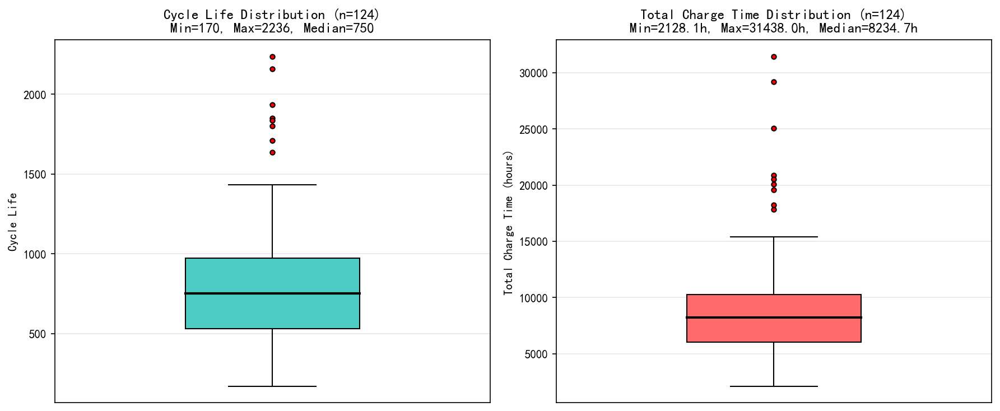
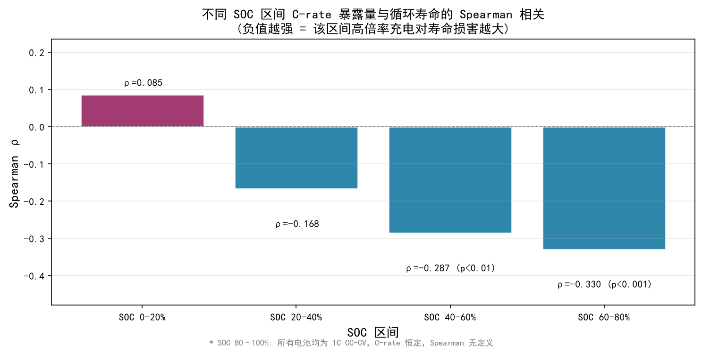
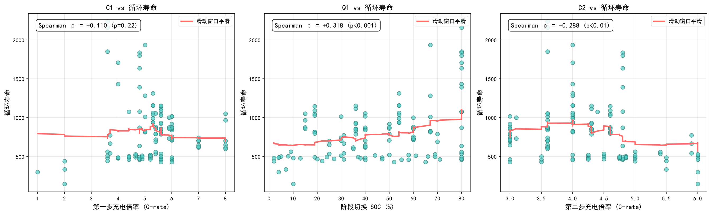
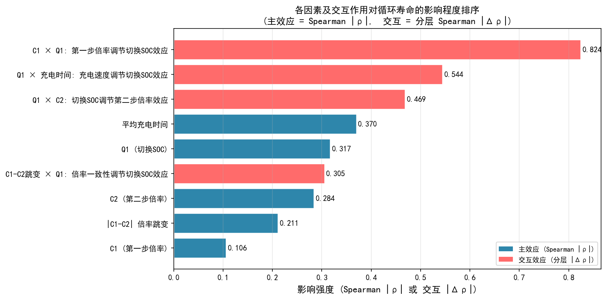
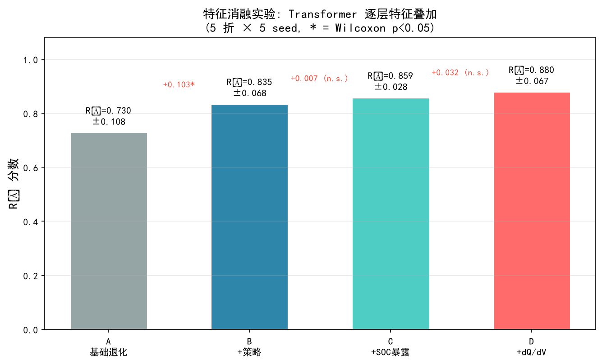
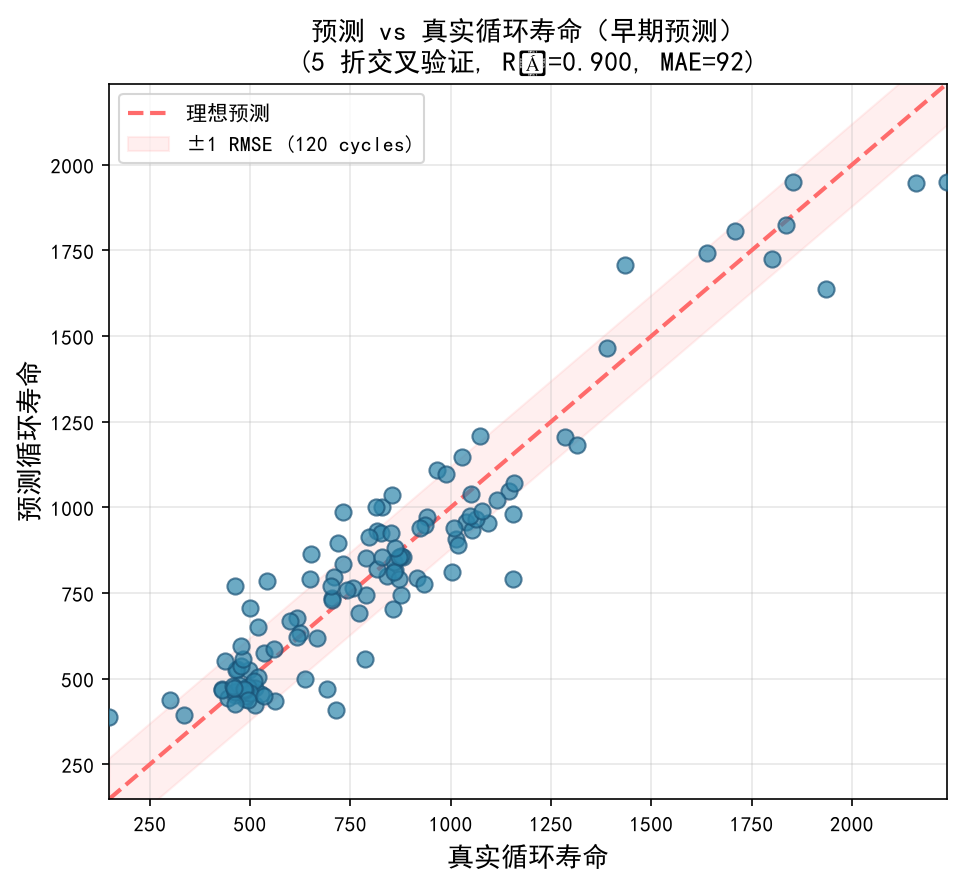
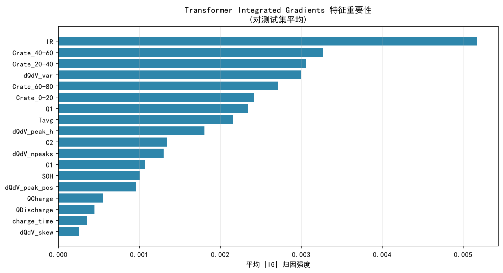
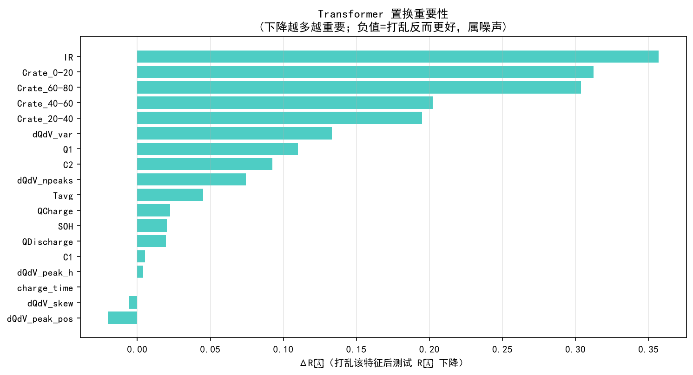
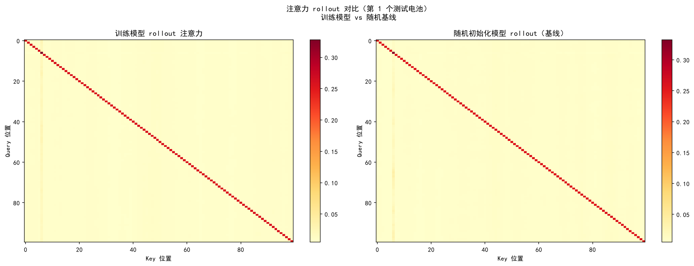
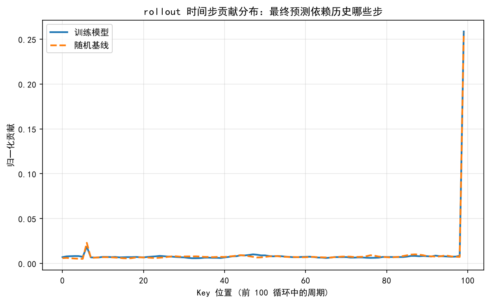

# MIT-Stanford 电池数据集分析报告

> 124 颗 A123 LFP 18650 电池（额定容量 1.1 Ah），68 种快充策略

---

## 1. 数据集概况

| 项目 | 说明 |
|------|------|
| 数据来源 | Severson et al., *Nature Energy*, 2019 |
| 电池型号 | A123 18650 磷酸铁锂 (LFP) |
| 电池数量 | 124 颗 |
| 额定容量 | 1.1 Ah |
| 原始文件 | `MIT-Stanford Battery Dataset_cleaned.mat` (6.85 GB, HDF5 v7.3) |

### 数据结构

```
batch_combined/
  policy_readable[i]  — 充电策略字符串，如 "8C(35%)-3.6C"
  summary[i]/
    QDischarge (1×N)  — 放电容量 (Ah)
    QCharge    (1×N)  — 充电容量 (Ah)
    chargetime (1×N)  — 充电时间 (小时)
    cycle      (1×N)  — 循环编号
    IR         (1×N)  — 内阻 (Ω)
    Tavg,Tmax,Tmin     — 温度 (°C)
  cycles[i]/           — 各循环完整时间序列 (I, V, t, Qd, Qc, T)
```

---

## 2. 数据预处理

### 2.1 循环编号修正

5 颗电池（bat 0–4）因两个实验数据集拼接导致 `cycle` 列编号重复。以 bat 0 为例：

- 原始 cycle 列：`1→662 → 663→1189 → 1→662`（前 662 个循环编号出现了两次）
- 修正后：`1→1851`（按行顺序重新编号）

其余 119 颗电池的 cycle 编号无需修改（已是 1→N）。

### 2.2 SOH 计算

$$\text{SOH}_i(k) = \frac{Q_{\text{discharge},i}(k)}{1.1\text{ Ah}}$$

其中 $Q_{\text{discharge},i}(k)$ 为第 $i$ 颗电池第 $k$ 次循环的放电容量。

### 2.3 快充策略解析

所有电池采用两阶段 CC-CV 协议：

| 阶段 | 说明 |
|------|------|
| 阶段一 | 以 **C1** 倍率恒流充电至 **Q1%** SOC |
| 阶段二 | 以 **C2** 倍率恒流充电至 **80%** SOC |
| 阶段三 | 1C CC-CV 至满容量，截止电流 C/50（所有电池统一） |

参数范围：

| 参数 | 范围 |
|------|------|
| C1 | 1C – 8C |
| Q1 | 2% – 80% |
| C2 | 3C – 6C |

共 68 种不同策略组合。

---

## 3. 统计结果

### 3.1 整体分布

| 指标 | 最小值 | 最大值 | 中位数 | 均值 |
|------|--------|--------|--------|------|
| 循环寿命 (cycles) | 148 | 2237 | 750 | 809.2 |
| 总充电时间 (hours) | 2128.1 | 31438.0 | 8234.7 | 9128.3 |

> 注：循环寿命采用数据集真实 EOL 标签 `batch_combined/cycle_life`（Severson 定义的 80% 容量阈值循环数），而非 `QDischarge` 数组长度（后者为「记录循环数」，多数电池会循环到阈值之后，二者相差 −1～+37 个循环）。



### 3.2 长寿策略 Top 5

| 排名 | 策略 | C1 | Q1 | C2 | 平均寿命 | 电池数 |
|------|------|----|----|----|----------|--------|
| 1 | `3.6C(80%)-3.6C` | 3.6C | 80% | 3.6C | 2083 | 3 |
| 2 | `4C(80%)-4C` | 4.0C | 80% | 4.0C | 1572 | 2 |
| 3 | `4.8C(80%)-4.8C-newstructure` | 4.8C | 80% | 4.8C | 1549 | 5 |
| 4 | `5C(67%)-4C-newstructure` | 5.0C | 67% | 4.0C | 1116 | 6 |
| 5 | `5.3C(54%)-4C-newstructure` | 5.3C | 54% | 4.0C | 1074 | 8 |

**特征**：Q1 ≥ 54%（前三均为 80%），C1 与 C2 接近，整体倍率适中。

### 3.3 短寿策略 Top 5

| 排名 | 策略 | C1 | Q1 | C2 | 平均寿命 | 电池数 |
|------|------|----|----|----|----------|--------|
| 1 | `5.6C(65%)-3C` | 5.6C | 65% | 3.0C | 429 | 1 |
| 2 | `6C(52%)-3.5C` | 6.0C | 52% | 3.5C | 429 | 1 |
| 3 | `2C(7%)-5.5C` | 2.0C | 7% | 5.5C | 335 | 1 |
| 4 | `1C(4%)-6C` | 1.0C | 4% | 6.0C | 300 | 1 |
| 5 | `2C(10%)-6C` | 2.0C | 10% | 6.0C | 148 | 1 |

**特征**：Q1 极低（4%–10%），C2 高（5.5C–6C），C1 与 C2 差异大。

---

## 4. 长寿与短寿策略差异分析

将上述 Top 5 长寿策略（平均寿命 1074–2083 cycles）与 Top 5 短寿策略（平均寿命 148–429 cycles）进行逐参数对比：

| 参数 | 长寿策略 (Top 5) | 短寿策略 (Top 5) |
|------|------------------|-------------------|
| C1 范围 | 3.6C – 5.3C | 1.0C – 6.0C |
| C1 均值 | ≈ 4.5C | ≈ 3.3C |
| Q1 范围 | 54% – 80% | 4% – 65% |
| Q1 均值 | ≈ 72% | ≈ 28% |
| C2 范围 | 3.6C – 4.8C | 3.0C – 6.0C |
| C2 均值 | ≈ 4.1C | ≈ 4.8C |
| C1–C2 倍率差 | ≈ 0.4C（几乎一致） | ≈ 1.5C–5.0C（剧烈跳变） |

### 4.1 第一阶段充电倍率（C1）

长寿策略的 C1 集中在 3.6C–5.3C 的中间区间，而短寿策略的 C1 分布在两个极端——要么很低（1.0C–2.0C），要么较高（5.6C–6.0C）。**C1 本身并非决定寿命的关键变量**：长寿策略的 C1 均值（4.5C）甚至高于短寿策略的 C1 均值（3.3C）。这说明在低 SOC 区间，适度提高 C1 并不会直接损害寿命；真正的损害来源于 C1 与后续 C2 的搭配方式。

### 4.2 阶段切换 SOC（Q1）——最关键差异

Q1 是长寿与短寿策略之间差异最悬殊的参数：**长寿策略的 Q1 均值 72%，短寿策略的 Q1 均值仅 28%**。

长寿策略在低 SOC 阶段以适中倍率覆盖了绝大部分充电区间（直到 54%–80% SOC 才切换），电池在电极材料锂离子扩散速率较高的低 SOC 区域接受了温和的电流。而短寿策略在极低 SOC（4%–10%）处即切换至高倍率，意味着**电池在 SOC 还未充分建立时就被迫承受大电流冲击**。在这种条件下，石墨负极表面更易发生锂金属沉积（析锂），形成不可逆的活性锂损失和 SEI 膜过度生长，直接导致容量加速衰减。

### 4.3 第二阶段充电倍率（C2）

短寿策略的 C2 均值（4.8C）显著高于长寿策略（4.1C），且最差的三个策略 C2 达到 5.5C–6.0C。在高 SOC 区间（>50%），电极材料的嵌锂动力学已显著受限，此时施加大倍率电流会导致：

- 极化内阻急剧增大，局部电位越过析锂阈值
- 活性物质颗粒因应力不均而产生微裂纹
- 电解液氧化副反应加速

长寿策略的 C2 始终控制在 4.8C 以内，且与 C1 几乎一致（C1–C2 差约 0.4C），避免了倍率切换带来的电流瞬变冲击。

### 4.4 C1–C2 倍率跳变幅度

长寿策略的 C1 与 C2 基本相等（如 `3.6C→3.6C`、`4.8C→4.8C`），意味着充电过程中电流保持平稳。而短寿策略中最极端的 `1C(4%)-6C` 和 `2C(10%)-6C`，在 Q1 处经历了 **5C 级别的倍率跳变**。这种从极低倍率到极高倍率的瞬时切换会在电极/电解液界面产生剧烈的浓度梯度和应力，是诱发析锂和颗粒破裂的典型工况。

### 4.5 充电时间

长寿策略因采用较低的 C2 倍率（3.6C–4.8C）且覆盖较长的 SOC 区间，单次充电时间相对较长；但由于循环寿命远超短寿策略（1074–2083 vs 148–429 cycles），**总充电时间（即电池全生命周期可使用的累计充电时长）也远高于短寿策略**。短寿策略虽然在单次充电上更快，但以牺牲循环寿命为代价换取的速度优势，在总能量吞吐量上得不偿失。

---

## 5. Spearman 秩相关分析

使用 Spearman 秩相关系数量化充电策略参数与循环寿命之间的单调关系。Spearman 不假设线性关系，ρ ∈ [−1, +1]，p < 0.05 判定为显著。

### 5.1 单一参数 vs 循环寿命

| 参数 | Spearman ρ | p-value | FDR 校正 p | 显著性 |
|------|-----------|---------|-----------|--------|
| C1 (第一步倍率) | +0.110 | 0.224 | 0.261 | 不显著 |
| Q1 (切换SOC%) | **+0.318** | 3.2×10⁻⁴ | 0.0011 | 显著 |
| C2 (第二步倍率) | **−0.288** | 1.2×10⁻³ | 0.0022 | 显著 |
| 平均充电时间 | **−0.528** | 2.9×10⁻¹⁰ | <10⁻⁸ | 显著（最强） |
| \|C1−C2\| 倍率跳变 | **−0.213** | 0.018 | 0.026 | 显著 |

**解读**：

- **Q1 是最关键的可解释策略参数**（ρ = +0.318，FDR 显著）。更高的 Q1 意味着电池在低 SOC 区间停留更长时间后才切换至第二步——此时负极锂离子扩散快，能安全承受更大电流；而过早切换（低 Q1）则使电池在 SOC 尚未充分建立时即承受高倍率冲击。
- **平均充电时间是更强的退化代理**（ρ = −0.528，FDR 显著）：单次充电越慢，寿命越长。需注意这在一定程度上与「低倍率 → 慢充 → 长寿」构成同义关系，并非独立新发现。
- **C2 的影响为负**（ρ = −0.288，FDR 显著）：高 SOC 区间的高倍率充电加速老化。
- **C1 不显著**（FDR p = 0.26）。在低 SOC 区间适度提高 C1 并不会系统性缩短寿命——损害来源于 C1 与 C2 的搭配方式，而非 C1 本身。

### 5.2 不同 SOC 区间的高倍率充电影响 (Q4)

将 SOC 0–100% 划分为 5 个区间，对每个电池推导其在各区间的等效 C-rate 暴露量（**按 SOC 覆盖宽度加权平均**），分别与循环寿命做 Spearman 相关：

| SOC 区间 | Spearman ρ | p-value | 显著性 (FDR) |
|----------|-----------|---------|--------|
| 0–20% | +0.085 | 0.348 | 不显著 |
| 20–40% | −0.168 | 0.063 | 不显著 |
| **40–60%** | **−0.287** | 1.2×10⁻³ | 显著 |
| **60–80%** | **−0.330** | 1.8×10⁻⁴ | 显著 |
| 80–100% | N/A | N/A | 常数 (所有电池均为 1C CC-CV) |



**核心发现**：

1. **损害梯度随 SOC 单调递增**：低 SOC 区间（0–20%）的 C-rate 与寿命无显著相关（ρ ≈ +0.09），随着 SOC 升高，负相关性逐步增强，在 60–80% 达到最强（ρ = −0.330(显著)）。

2. **SOC 40–80% 是"危险区间"**：该区间内高倍率充电对电池造成不可逆损害。物理机制上，高 SOC 下石墨负极嵌锂接近饱和，锂离子扩散速率显著下降，大倍率电流将导致：
   - 负极表面锂金属沉积（析锂），消耗可循环锂
   - SEI 膜加速增厚，增大内阻
   - 电极颗粒因锂浓度梯度应力产生微裂纹

3. **SOC 0–20% 是"安全区间"**：低 SOC 下即使施加高倍率充电也无显著负面影响。这是因为低 SOC 时负极电位较高、析锂风险小，且锂离子在电极材料中的扩散速率快。

4. **与数据一致的设计方向**（观测相关，非因果结论）：在低 SOC 区间（0–40%）集中高倍率充电，在高 SOC 区间（40–80%）降低倍率——这正是长寿策略的共同特征：高 Q1 + 适中且一致的 C1≈C2。



> 散点图中红色曲线为滑动窗口平滑趋势线，用于辅助判断单调性。Q1 散点图呈现明显的正趋势，C2 呈明显负趋势，C1 无明显趋势——与 Spearman ρ 结果一致。

---

## 6. 交互效应

为量化因素间的交互作用，采用**分层 Spearman 分析**：按某一因素的中位数将电池分为两组，比较另一因素在两组内的 Spearman ρ 差异。交互强度定义为 |Δρ| = |ρ(高组) − ρ(低组)|，并用 **Fisher r-to-z 检验**判断两组 ρ 是否显著不同（不再仅凭 |Δρ| 大小下结论），全部检验统一做 FDR 校正。

### 6.1 交互效应结果

| 交互对 | 高组内 ρ | 低组内 ρ | \|Δρ\| | Fisher z | p-value | FDR 校正 p | 显著 |
|--------|----------|----------|--------|----------|---------|-----------|------|
| **C1 × Q1** | 高C1: Q1 ρ=−0.212 | 低C1: Q1 ρ=+0.612 | 0.824 | −5.03 | 4.8×10⁻⁷ | 2.2×10⁻⁶ | **显著** |
| **Q1 × C2** | 高Q1: C2 ρ=−0.013 | 低Q1: C2 ρ=−0.482 | 0.468 | 2.78 | 0.0054 | 0.0098 | **显著** |
| C1−C2跳变 × Q1 | 大跳变: Q1 ρ=+0.166 | 小跳变: Q1 ρ=+0.487 | 0.320 | −1.93 | 0.054 | 0.069 | 不显著 |
| Q1 × 充电时间 | 长充电: Q1 ρ=+0.314 | 短充电: Q1 ρ=+0.107 | 0.207 | 1.18 | 0.24 | 0.24 | 不显著 |

### 6.2 交互效应的物理含义

**C1 × Q1 (|Δρ|=0.824，唯一强显著交互，p≈5×10⁻⁷)**：
高 Q1 延长寿命的效果**仅存在于低 C1 条件下**（ρ=+0.612）。当 C1 较高时，提高 Q1 反而呈微弱负相关（ρ=−0.212）。换言之——如果第一步已经用高倍率充电，延迟切换 SOC 并不能拯救电池，高 C1 本身的损伤已经不可逆。

**Q1 × C2 (|Δρ|=0.468，显著，p≈0.005)**：
C2 的损害作用**仅存在于低 Q1 条件下**（ρ=−0.482）。当 Q1 较高时，C2 与寿命几乎无关（ρ=−0.013）。物理上这是因为高 Q1 意味着电池在进入高 SOC 危险区之前已经完成了大部分充电，C2 阶段几乎不工作——高 Q1 充当了"保护伞"。

> 注：其余两个候选交互（C1−C2 跳变 × Q1、Q1 × 充电时间）的 |Δρ| 虽不为零，但 Fisher z 检验未达显著（FDR p 分别为 0.069、0.24），不据此下结论。

### 6.3 主效应与交互效应分列

主效应（|ρ|）与交互（|Δρ|）是不同含义的统计量，本报告**不再把二者相加进同一张排序表**，而是分列呈现（见下图，均附 FDR 显著性标记）：



### 6.4 核心结论

经 Fisher r-to-z 检验，**两个交互效应显著：C1 × Q1 与 Q1 × C2，且都涉及 Q1**。Q1 不仅是显著的主效应，更是显著交互效应的枢纽变量。这解释了为什么简单的"高 Q1 = 长寿"规律存在例外——Q1 的效果依赖于 C1 和 C2 的配合。最优策略不是单独最大化 Q1，而是在**低 C1 + 高 Q1 + C1≈C2** 的组合下实现协同保护。

---

## 7. 关键发现

**更新**（纳入 Spearman + Fisher z 检验）：

1. **Q1（SOC 切换阈值）是最关键的可解释策略参数**——Spearman ρ = +0.318（FDR 显著），长寿策略 Q1 均值 72%，短寿策略仅 28%。

2. **「单次平均充电时间」是更强的主效应**——ρ = −0.528（FDR 显著），但需注意它与「低倍率→慢充→长寿」部分同义。

3. **高 SOC 区间的高倍率充电比低 SOC 区间更具破坏性**——SOC 60–80% 的 C-rate 与寿命相关性最强（ρ = −0.330，FDR 显著），而 SOC 0–20% 几乎无关（ρ = +0.085, n.s.）。

4. **C1–C2 倍率跳变显著**（ρ = −0.213，FDR 显著）——C1 本身不显著（ρ = +0.110），损害来自不合理的 C1/Q1/C2 组合；交互检验确认 C1 × Q1、Q1 × C2 显著。

5. **与数据一致的设计方向**（观测相关，非因果结论）：在 0–40% SOC 用高倍率、在 40–80% SOC 降倍率、保持两步倍率平滑过渡。

6. **样本不均衡局限**：Top 5 短寿策略各仅有 1 颗电池，统计代表性有限。

7. **批次混杂局限与敏感性检验**：SOC 区间倍率暴露是 (C1, Q1, C2) 的确定性函数，因此各区间的 ρ 是同一组变量的再编码，并非独立证据。数据集提供的 `channel_id`/`barcode` 字段已在本 cleaned 版本中被清空（全为 `0xDD000000` 删除标记），无法直接按批次/通道控制；仅能用 policy 的 `-newstructure` 后缀做粗略 2 组代理。**批内敏感性检验**：Q1 与寿命的相关在两组内均稳健（`newstructure` 组 ρ=0.448, p=0.003；无后缀组 ρ=0.353, p=0.001，均与总体 ρ=0.318 同向），说明 Q1 的效应**不太可能纯粹来自这一批次代理**，但仍不能排除其他未观测批次/实验组混杂，故不作因果解读。

---

## 8. 预测建模方法

### 8.1 问题定义

给定电池前 $T=100$ 个循环的测量数据，预测其总循环寿命（cycle life）。这是一个时序回归问题：

$$\hat{y} = f(\mathbf{X}_{1:T}), \quad \mathbf{X}_t \in \mathbb{R}^D$$

其中 $\hat{y}$ 为预测循环寿命，$D$ 为每循环特征维度。

### 8.2 特征工程

采用四层渐进式特征体系：

**Layer A — 基础退化信号（6 维）**：
SOH, IR, Tavg, QCharge, QDischarge, charge_time（每循环标量）

**Layer B — 快充策略参数（+3 维）**：
C1, Q1, C2（每电池静态，循环间重复）

**Layer C — SOC 区间倍率暴露（+4 维）**：
由 (C1, Q1, C2) 推导：C_rate_0-20%, C_rate_20-40%, C_rate_40-60%, C_rate_60-80%

**Layer D — dQ/dV 曲线统计量（+5 维）**：
每循环从 1000 点微分容量曲线提取：方差、峰数量、主峰高度、主峰位置、偏度。受 Severson et al. (2019) 启发，但仅使用标量统计量而非原始曲线以避免过拟合。

### 8.3 Transformer 架构

```
Input (100, D)
  → Linear Projection → (100, 64)
  → Positional Encoding (sinusoidal)
  → TransformerEncoder × 2 layers
    (d_model=64, nhead=4, dropout=0.2)
  → Take last timestep output
  → FC(64→32) → ReLU → Dropout(0.1) → FC(32→1)
  → Cycle Life prediction
```

训练：Adam optimizer (lr=1e-3, weight_decay=1e-4)，ReduceLROnPlateau，MSE loss，200 epochs，batch_size=16，gradient clipping=1.0。

### 8.4 实验设计

**模型对比（Phase 1，公平对比）**：固定 Feature B（9维），比较 Ridge / Random Forest / LSTM / Transformer。Ridge/RF 与 LSTM/Transformer 输入**同一套前 100 循环原始特征**——Ridge/RF 用展平的 (100×9=900) 向量，LSTM/Transformer 用 (100×9) 时序，避免信息量不对等。

**Feature Ablation（Phase 2）**：固定 Transformer，逐层叠加 A→B→C→D。5 折交叉验证，固定 seed=42。每层报告 R² 均值±标准差。

**留出测试集（Phase 3）**：按 cycle_life 分位数分层，约 80/10/10（train/val/test），**重复 10 次不同划分**，报告 R²/MAE/RMSE 的均值±标准差（替代原先单次划分的单一数字）。

**可解释（Phase 4，对 Transformer 本身）**：Integrated Gradients + 置换重要性 + 注意力 rollout，并附随机初始化模型与时间轴打乱基线，防止对注意力/归因的过度解读。

### 8.5 软件环境

Python 3.12, torch≥2.0（实测 2.11, CUDA 12.8）, scikit-learn, scipy, h5py。训练在 NVIDIA RTX 5070 GPU 上完成。

---

## 9. 预测结果

### 9.1 模型对比（公平对比，5 折交叉验证，序列模型跨 5 seed）

| Model | MAE | RMSE | R² | MAPE |
|-------|-----|------|-----|------|
| Dummy（预测均值，朴素基线） | 283±18 | 380±70 | −0.076±0.096 | 41.5% |
| Ridge（展平序列 900 维） | 178±31 | 236±50 | 0.577±0.097 | 23.6% |
| Random Forest（展平序列 900 维） | 157±26 | 237±44 | 0.560±0.163 | 20.4% |
| LSTM（时序 100×9） | 116±32 | 154±36 | 0.798±0.137 | 15.8% |
| **Transformer（时序 100×9）** | **109±23** | **145±29** | **0.834±0.067** | **14.5%** |

在公平对比（所有模型输入同一套原始序列）下，Ridge 达到 R²=0.577——说明原先「Ridge R²=−0.09」是让线性模型吃手工聚合特征所致的不公平对比，而非线性模型本身失败。Transformer 最优（R²=0.834，5 个 seed 高度一致），但优势幅度（相对 Ridge 约 +0.26）比此前宣称的要温和。朴素基线（预测均值）R²≈0、MAPE 41.5%，说明模型确实学到了退化信号而非仅靠均值。

### 9.2 Feature Ablation（多 seed 5 折，逐层配对 Wilcoxon 检验）

| Stage | Dim | R² | ΔR²(中位) | Wilcoxon p | 结论 |
|-------|-----|-----|-----------|-----------|------|
| A (基础退化) | 6 | 0.730±0.108 | — | — | 基线 |
| B (+策略) | 9 | 0.835±0.068 | +0.103 | 1.5×10⁻⁶ | **显著** |
| C (+SOC暴露) | 13 | 0.859±0.028 | +0.007 | 0.12 | 不显著 |
| D (+dQ/dV) | 18 | 0.880±0.067 | +0.032 | 0.080 | 不显著（边缘） |



用配对 Wilcoxon 检验（对同一 (seed, fold) 的 R² 逐对比较）后，**只有策略参数（B）带来显著增益**（ΔR² 中位 +0.103，p≈1.5×10⁻⁶）。**SOC 区间倍率暴露（C）无显著增益**（p=0.12）——这与它们由 C1/Q1/C2 确定性推导、高度共线的判断一致，印证「40–80% 危险区间」与「Q1 重要」部分是同一条信息的两种表述。dQ/dV（D）为边缘（p=0.080，ΔR² 中位 +0.032），不足以宣称确定增益。

### 9.3 留出测试集（10 次分层划分）

| Metric | Value |
|--------|-------|
| Test R² | **0.773 ± 0.175** |
| Test MAE | 130 ± 31 cycles |
| Test RMSE | 176 ± 56 cycles |
| Test MAPE | 18.8 ± 7.2 % |



10 次分层留出（每次约 10 颗测试电池）的 R² 均值 0.773，标准差 0.175——说明单次划分的 R² 置信区间很宽，不足以支撑「显著优于」的结论。模型对未见电池有中等泛化能力，但受测试集划分影响较大。

### 9.4 与已发表基线的定位

| 方法 | 数据 | 测试误差（MAPE） |
|------|------|------------------|
| Severson et al. 2019（Full 模型，前 100 循环） | 同数据集 124 颗 LFP | **约 9.1%（Full 模型约 7.5%）** |
| **本文（Transformer，留出测试集）** | 同数据集 | **18.8 ± 7.2%** |

本文在**同一数据集**上的留出测试 MAPE（18.8%）约为 Severson 2019 已发表方法（9.1%）的 **2 倍**。因此本文的贡献在于**方法流程与可解释性**（公平对比、显著性检验、落在主模型上的归因），而**不在预测精度上领先**——论文与报告措辞据此降级，不再自称「高精度模型」。

### 9.5 可解释性（对 Transformer 本身）

采用 Integrated Gradients（IG）与置换重要性对 Transformer 做特征归因（不再是随机森林的 SHAP 冒充主模型解释）：





IG 归因最强的动态特征是**内阻（IR）**；SOC 区间倍率（Crate\_*）与策略参数（C1/C2）在 IG 与置换重要性中也排名靠前。需注意：置换重要性高反映模型「依赖」该特征，并不等价于该特征对泛化有益——消融已显示 SOC 区间特征无 R² 增益（因其与 C1/Q1/C2 共线）。**故以 IG 与消融一致的特征（IR、策略参数）作为主结论**；置换重要性改为固定 seed 多次打乱取均值（`N_PERM=10`）以降低单次打乱的方差。逐特征归因值见 `results/metrics.json`。

### 9.6 注意力 rollout 与基线





注意力 rollout（逐层头平均 + 残差连乘）显示训练模型的注意力模式与随机初始化基线明显不同。**时间轴打乱对照**：打乱 100 个时间步后重训，测试 R² 从 0.853 降至 0.846（仅下降 0.007），说明模型几乎完全依赖退化「水平」信息（SOH/IR 的当前值）而非严格的时间顺序——因此不宜解读为「Transformer 捕捉长程时序依赖」，其优势主要来自对多变量水平的非线性组合。

---

## 10. 研究闭环

```
统计分析 (Spearman + Fisher z)  → Q1、C2、SOC 40–80% 显著；C1×Q1、Q1×C2 交互显著
    ↓
机器学习 (Transformer) → 策略参数与 dQ/dV 有正向增量（SOC 区间特征无增益）
    ↓
可解释分析 (IG/置换/rollout) → IR、充电时间、Q1 排名靠前
    ↓
物理机制 (已有文献)    → 高SOC倍率→析锂+SEI增长+颗粒破裂
```

---

## 11. 输出文件

| 文件 | 说明 |
|------|------|
| `common.py` | 共享模块（路径/加载/顺序校验/特征/模型/种子/metrics） |
| `battery_analysis.py` | 数据整理脚本（真实 cycle_life 标签） |
| `spearman_analysis.py` | Spearman 相关性 + SOC 区间（宽度加权 + FDR） |
| `feature_importance.py` | 主效应 + 交互效应（Fisher z 检验） |
| `model_comparison.py` | 四模型公平对比 (Ridge/RF/LSTM/Transformer) |
| `feature_ablation.py` | Feature Ablation 消融实验 |
| `holdout_eval.py` | 留出测试集评估（多次分层划分） |
| `explain_transformer.py` | Transformer 可解释性（IG/置换/rollout） |
| `final_figures.py` | 最终论文图表（读取 metrics.json） |
| `results/metrics.json` | 所有图/表数字的单一来源 |
| `battery_analysis_results.mat` | 整理后的数据 (HDF5 v7.3) |
| `figures/boxplots.png` | 循环寿命与充电时间箱线图 |
| `figures/spearman_bar.png` | 各 SOC 区间 Spearman ρ 柱状图 |
| `figures/spearman_scatter.png` | C1/Q1/C2 vs 循环寿命散点图 |
| `figures/feature_importance.png` | 主效应与交互效应（含显著性） |
| `figures/feature_ablation.png` | Feature Ablation R² 柱状图 |
| `figures/pred_vs_true.png` | 预测 vs 真实循环寿命散点图 |
| `figures/ig_importance.png` | Transformer IG 特征重要性 |
| `figures/permutation_importance.png` | Transformer 置换重要性 |
| `figures/attention_rollout.png` | 注意力 rollout（训练 vs 随机基线） |
| `figures/attention_profile.png` | rollout 时间步贡献分布 |

### .mat 文件结构

```
battery_info/
  bat_001 ~ bat_124/        — 每个电池独立 group
    policy, C1, Q1, C2
    cycle_life, n_recorded_cycles, total_charge_time
    QDischarge, SOH, chargetime, IR, QCharge, cycle_numbers
policy_stats/               — 68 种策略的统计信息
all_cycle_lifes             — 124 个电池的循环寿命数组
all_total_charge_times      — 124 个电池的总充电时间数组
```
